# Hacking-reality-poetically-NYC-07-18
Code for unexpected events ('hacking reality') and living life poetic way

***

I was a part of Code Societies – School for Poetic Computation session in New York this summer. I was exploring coding and how to make it poetic and socially meaningful / coding and working publicly and together and finally coding for and in life, exploring social codes, interactions and behaviours and hack the reality to discover poetics that are embeded in life waiting sometimes right behind the corner for those who wish to make them their life.

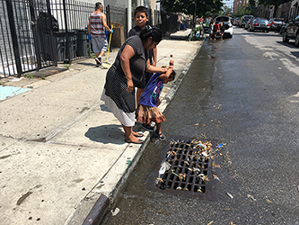
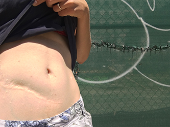
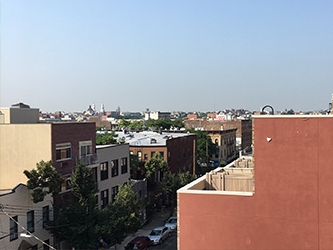

I hardly know New York. I haven’t seen many of the highlights. Instead, I surrender to ritual of evening walks, when Latin music comes from every corner and the scent of bbq spreads in the air. I still can not understand why water is pouring out of hydrants all days long. But I discovered the secret of beige rubber bands with which the sidewalks are paved (NY Times is always wrapped with them). I know the evening the big garbage bags lands on the sidewalks. I took a street dance course during a family barbecue at a car workshop, I sailed around the park with a friend from Venezuela, whom I met the day before getting lost in the subway. I was strolling along the High Line with a friend from Turkey who waited a long time for me and was not angry at all. He explained that it was New York that has changed him, that he is not angry anymore and he learned to wait.

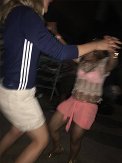
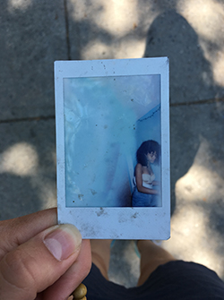
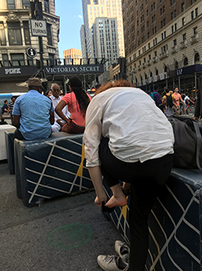

New York is full of people walking their own way. My way at that time was the school. And every day there was a challenge to understand something new, to get into someone's completely different perspective. I went to NY thinking that something would be cleared up and that I would know more. That I will find some answers, that now it will be downhill because I will "know how". I feel closer to something, but the most I'm probably – I'm just on the road. And I realized my whole life can look like this. So it is not preparation for life, a profession, a mission, an expedition. Everything is already happening. Since I am on the road, I always want to be on this road as long as I am. I want to see the road and not just its individual moments, some shots once and in the past, which do not form one coherent picture. I want to see the way how it changes and evolves, slowly one place changes into another and one feeling into the other one. Beliefs,  ambitions, certainties, hopes. It is very important for me not to deny what has happend. As not to cut off the way I have gone but to show it as one story. The story that no longer falls into my head, as that all could happened together, on one storyline, or rather - in one small body.

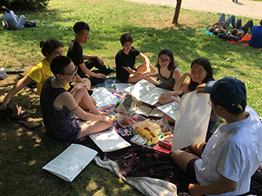
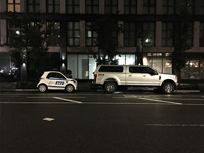
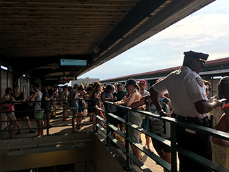

# Hack-a-day

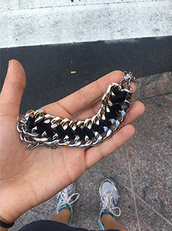 

I  was walking and I saw a man trying to fasten a bracelet on his wrist. 
<pre><code>I asked if he needs help.</code></pre>
"No" he replied. But then he said that he found today two bracelets on the sidewalk, he took that second one and gave it to me. I didn't want to take it, but he insisted on that. We were walking and talking. He told me that he was homeless for 5 years, but he found the way to God or that was God who found him. He got a job and started to fight his alcohol addiction. Now he's doing well. He recently met with his son who lives in New Jersey. He didn't want to get anything from me, but he asked for prayer. Later on I discovered on the bracelet there's a sign:
<pre><code>"Dear M."</code></pre>

***

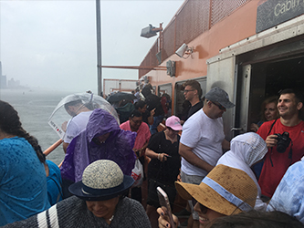

I  went to ferry stop on East River and the machine didn't print my ticket. I've tried again with the other one and then those two men came speaking Polish.
<pre><code>I talked to them happy to hear familiar speech.</code></pre>
They were happy to meet me too. They can't speak English. They decided to go with me. We spend half of the day together. They went home earlier because the day after they were staring work early morning. We met again – once we went to Times Square and the second time to Dumbo and Brooklyn Bridge. Their work is very hard and all day long. But as one of them wrote me – I made them feel more secure and encourage them to explore the city.
<pre><code>He said that New York inspires him and gives him new enthusiasm.</code></pre>

***

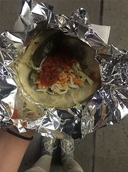

Classes ended late but I cannot go straight back home.
I felt like I need some extra time to deal with all the thoughts brewing in my mind. 
<pre><code>Walk is always the way for me.</code></pre>
So I was walking around my neighborhood. I stoped by PUPUSERIA. I was wondering what is that. There were two elderly women working there who draw my attention, they seemed to be so joyful. They called me and insisted I need to try it. I've realised I was really hungry but I had no more money in my purse. The woman's husband was Polish as she told me.
 "You'll pay later" she said. "I know you'll pay". So I did, but "the gifted" tasted incredibly good that evening.

***

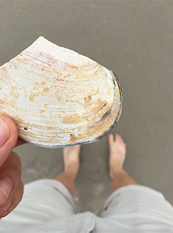

That was the 4th of July and I was walking alone and suddently I came with the idea to go to the beach. I wondered I would have a good time if I went there alone. But I took a train. There was one man standing there alone too.
<pre><code>I simply ask him for the way to the beach to make sure I was on the right track.</code></pre>
Then we start talking and went together to the beach, met his friends there and spend there some more time with them.
We met twice after that meeting. Once we've been to Whitney, he just got a membership there. He's an enginner but very interested into art.
The second time we've been to Babycastles. He enjoyed it. He has a talent for telling funny stories. We had great time together, walking a lot.

***

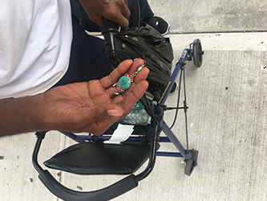 

There was a man sitting on the chair on the sidewalk.
<pre><code>I stopped 
and I asked:
	Excuse me, do you have anything unwanted?</code></pre>
He was thinking for a while and then with a smile on his face he stood up, lifted a seat and from the little storage underneath he took a little object. That was a colorful earring. "I found it today in the morning under the bench over there" – he pointed to the other side of the street. I was very embarased to take his own tresure but then I realised I found an earing too. "I found it a week ago" – I said and gave him my goldish earring. We made a deal. The man smiled from ear to ear.

*** 

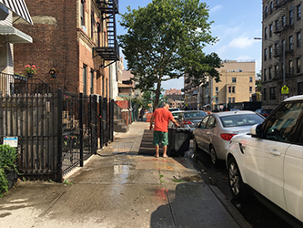 

There was a man cleaning the trash can with a hose.
<pre><code>I took a small plastic box from my bag, stoped by and open the lid.</code></pre>
The man immediatelly turned the stream of the water so it became very, very tiny and he poured the water into the box. I turned the lid on, thanked him and went on.

***

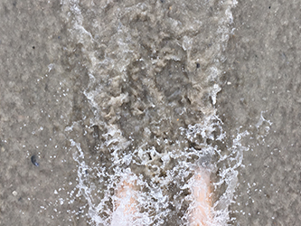
